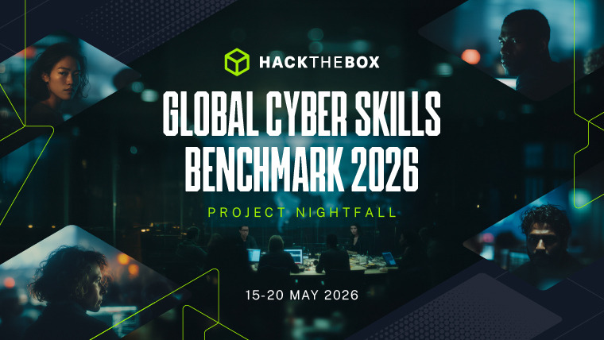
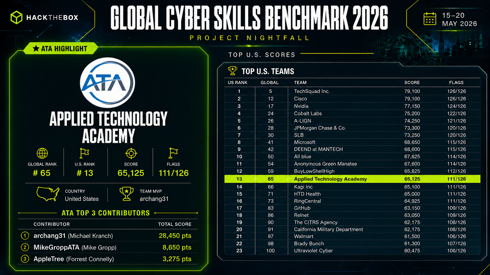

# Global Cyber Skills Benchmark CTF 2026: Project Nightfall Writeups

This repository contains public writeups for challenges solved during the Hack The Box Global Cyber Skills Benchmark CTF 2026: Project Nightfall. All solutions were completed in an authorized, competitive environment. Flags, credentials, and environment-specific values are redacted throughout.

---

## Event Information

| Field | Value |
|-------|-------|
| Event | Global Cyber Skills Benchmark CTF 2026: Project Nightfall |
| Platform | Hack The Box |
| Start | May 15, 2026, 09:00 AM UTC |
| End | May 20, 2026, 09:00 AM UTC |
| Event Page | https://ctf.hackthebox.com/event/details/global-cyber-skills-benchmark-ctf-2026-project-nightfall-3296 |
| Scoreboard | https://ctf.hackthebox.com/event/3296/scoreboard |

---

## About Project Nightfall

"Secure the dependencies. Save the state."

In a world where influence is measured by control of shared dependencies rather than territory, Project Nightfall represents the front line of nation-state cyber operations. Rival coalitions and APT units have spent years embedded within virtualization stacks, identity providers, and supplier ecosystems to gain strategic leverage. While state-enabled proxies launch high-visibility distractions, the true threat remains deniable, quietly shaping infrastructure from within.

As part of Task Force Nightfall, the mission was to embed within critical infrastructure operators, root out deep-seated persistence in vendor tooling, and maintain national resilience against rising global interference.

---

## Results





---

## Repository Structure

Each challenge folder follows this layout:

```
<category>/<challenge-name>/
  README.md       - Polished writeup: Summary, Walkthrough, Key Findings, Lessons Learned
  work/           - Solve scripts and helper tools used during the solve
  screenshots/    - Images referenced in the writeup (if applicable)
```

Challenge-provided artifacts (binaries, archives, PCAPs, disk images) are not committed to this repository due to file size and licensing. Each writeup lists what was provided.

---

## Writeups

| Challenge | Category | Status |
|-----------|----------|--------|
| [Lotus Registry](ai/lotus-registry/README.md) | AI | Solved |
| [Grant Registry](blockchain/grant-registry/README.md) | Blockchain | Solved |
| [Exposed Supply](cloud/exposed-supply/README.md) | Cloud | Solved |
| [Ghost Access](cloud/ghost-access/README.md) | Cloud | Solved |
| [Privilege Chain](cloud/privilege-chain/README.md) | Cloud | Solved |
| [Cascade Depth](coding/cascade-depth/README.md) | Coding | Solved |
| [Checksum Mismatch](coding/checksum-mismatch/README.md) | Coding | Solved |
| [Choke Point](coding/choke-point/README.md) | Coding | Solved |
| [Incident Window](coding/incident-window/README.md) | Coding | Solved |
| [Surge Protocol](coding/surge-protocol/README.md) | Coding | Solved |
| [Once or Nothing](crypto/once-or-nothing/README.md) | Cryptography | Solved |
| [Pow Pow](crypto/pow-pow/README.md) | Cryptography | Solved |
| [Twice or Nothing](crypto/twice-or-nothing/README.md) | Cryptography | Solved |
| [COMfortable Exfiltration](forensics/comfortable-exfiltration/README.md) | Forensics | Solved |
| [Open Wound](forensics/open-wound/README.md) | Forensics | Solved |
| [Stay Hydrated](forensics/stay-hydrated/README.md) | Forensics | Solved |
| [The Gilded Ghost](forensics/the-gilded-ghost/README.md) | Forensics | Solved |
| [Trust and Betrayal](forensics/trust-and-betrayal/README.md) | Forensics | Solved |
| [Orion](fullpwn/orion/README.md) | FullPwn | Solved |
| [NECVISION](hardware/necvision/README.md) | Hardware | Solved |
| [VoltGrid CSMS](hardware/voltgrid-csms/README.md) | Hardware | Solved |
| [Sector Blackout](ics/sector-blackout/README.md) | ICS | Solved |
| [Watermark](ml/watermark/README.md) | Machine Learning | Solved |
| [Flashpoint](pwn/flashpoint/README.md) | Pwn | Solved |
| [Relay](pwn/relay/README.md) | Pwn | Solved |
| [Unverified Patch](pwn/unverified-patch/README.md) | Pwn | Solved |
| [Ghost Splicer](quantum/ghost-splicer/README.md) | Quantum | Solved |
| [Operator Silence](quantum/operator-silence/README.md) | Quantum | Solved |
| [Dudsat](reversing/dudsat/README.md) | Reverse Engineering | Solved |
| [Sysprobe](reversing/sysprobe/README.md) | Reverse Engineering | Solved |
| [Ariadne's Hand](secure-coding/ariadnes-hand/README.md) | Secure Coding | Solved |
| [Le Paradis et L'Enfer](secure-coding/le-paradis-et-lenfer/README.md) | Secure Coding | Solved |
| [The Dark Night](secure-coding/the-dark-night/README.md) | Secure Coding | Solved |
| [Trust Fall](web/trust-fall/README.md) | Web | Solved |

---

## Disclaimer

All writeups in this repository were produced during an authorized, time-limited Capture the Flag competition hosted by Hack The Box. The techniques described are shared for educational purposes and to advance understanding of offensive and defensive security. None of the techniques described here should be applied against systems without explicit written authorization from the system owner.
